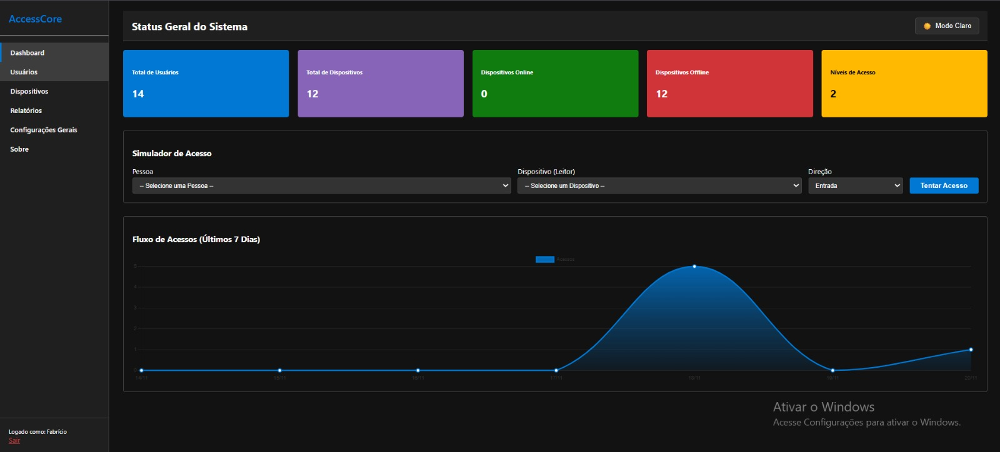
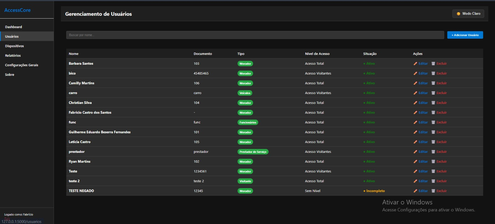
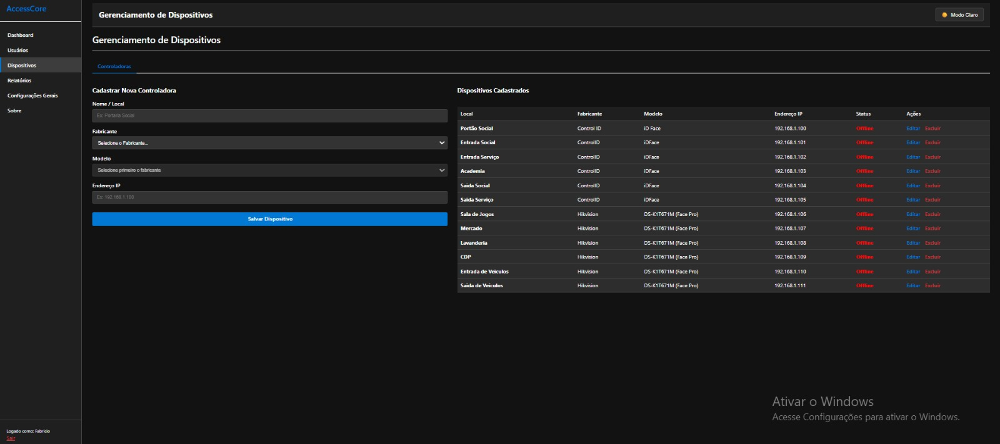
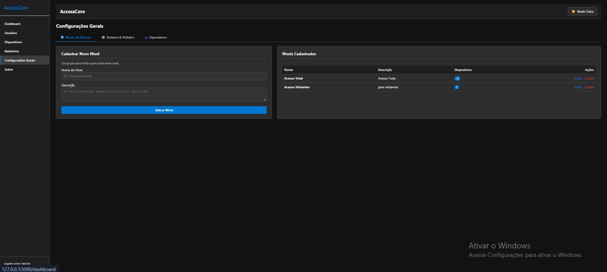
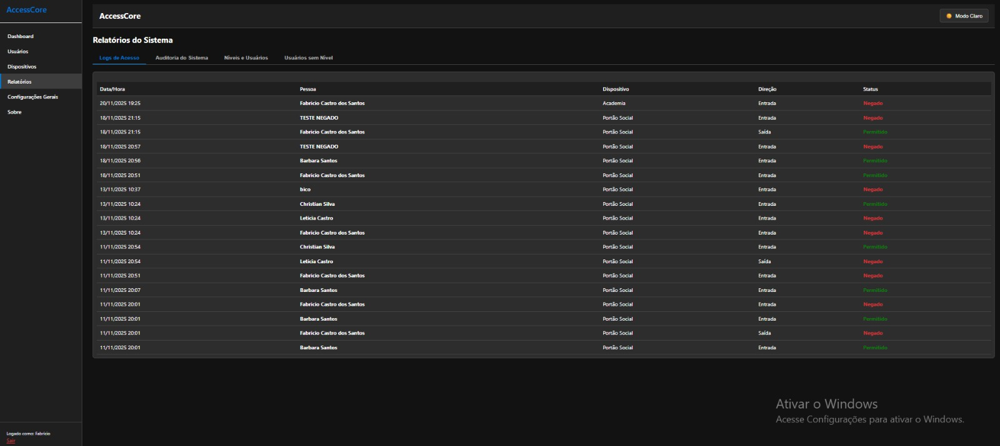
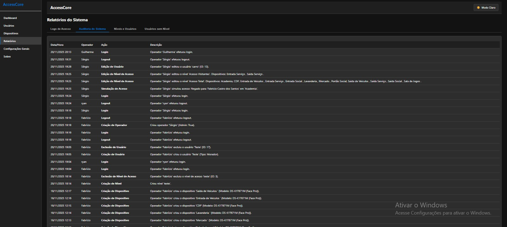
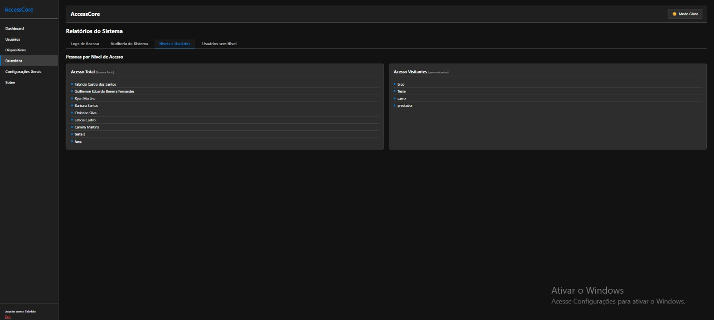
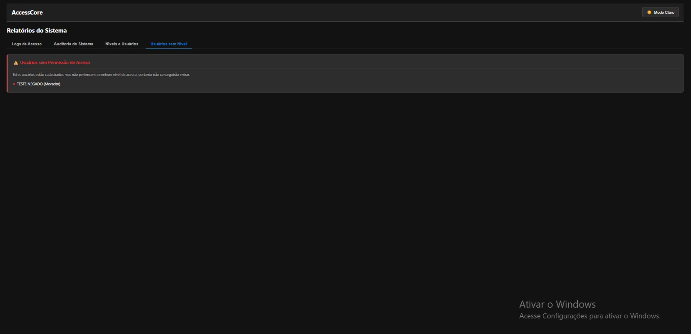
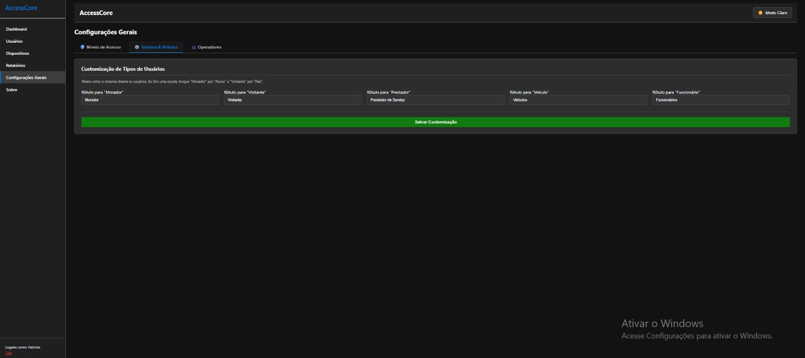
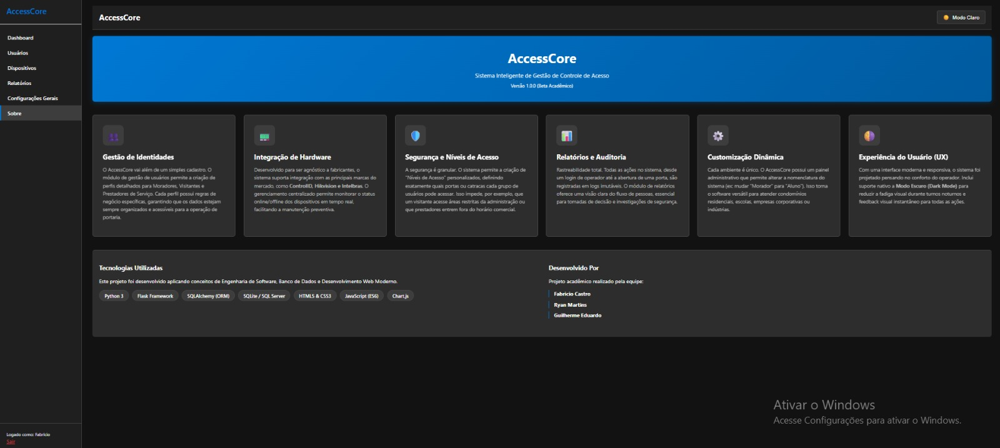

# 🔐 AccessCore

### Sistema de Gestão e Simulação de Controle de Acesso

O **AccessCore** é uma aplicação web desenvolvida como projeto acadêmico do curso de **Ciência da Computação**, com o objetivo de representar o funcionamento de uma plataforma de gerenciamento de controle de acesso.

O sistema foi inspirado em cenários reais de **segurança eletrônica e controle de acesso**, permitindo gerenciar usuários, dispositivos, níveis de acesso, operadores e eventos de entrada e saída.

> 🎓 Projeto acadêmico desenvolvido em equipe.

---

## 📸 Visão Geral



O dashboard apresenta uma visão geral do ambiente, incluindo quantidade de usuários, dispositivos cadastrados, equipamentos online/offline, níveis de acesso e fluxo de eventos.

O sistema também possui um simulador que permite selecionar uma pessoa, um dispositivo e a direção da passagem para validar se aquele usuário possui ou não permissão de acesso.

---

## 🚀 Principais Funcionalidades

### 👤 Gerenciamento de Usuários

O sistema permite cadastrar e administrar diferentes tipos de usuários, como:

- Moradores
- Visitantes
- Prestadores de serviço
- Funcionários
- Veículos

Cada usuário pode ser associado a um **nível de acesso**, determinando quais locais ou dispositivos estão autorizados para aquele cadastro.



---

### 🖥️ Gerenciamento de Dispositivos

O AccessCore permite cadastrar os dispositivos que fazem parte do ambiente de controle de acesso.

Cada dispositivo pode possuir informações como:

- Local
- Fabricante
- Modelo
- Endereço IP
- Status

O projeto simula equipamentos de diferentes fabricantes para representar um ambiente com múltiplos dispositivos.



---

### 🔑 Níveis de Acesso

O sistema permite criar **níveis de acesso** e associar dispositivos específicos a cada nível.

Dessa forma, diferentes grupos de usuários podem possuir permissões distintas dentro do ambiente.

Por exemplo:

```text
Acesso Total
├── Portão Social
├── Academia
├── Entrada de Serviço
├── Mercado
└── Entrada de Veículos

Acesso Visitantes
├── Portão Social
└── Entrada de Serviço
```



---

### 🧪 Simulação de Acesso

O AccessCore possui uma funcionalidade para simular eventos de passagem.

Durante a simulação, são considerados:

- Usuário
- Dispositivo
- Direção da passagem
- Nível de acesso
- Permissões associadas

A partir dessas informações, o sistema verifica a regra de acesso e registra o evento como:

```text
PERMITIDO
```

ou

```text
NEGADO
```

O fluxo simplificado funciona da seguinte forma:

```text
Usuário
   ↓
Nível de Acesso
   ↓
Dispositivo
   ↓
Validação da Permissão
   ↓
Permitido / Negado
   ↓
Registro do Evento
```

---

## 📊 Relatórios

O sistema possui diferentes consultas para análise das informações registradas.

Entre elas:

- Logs de acesso
- Auditoria do sistema
- Usuários por nível de acesso
- Usuários sem nível de acesso

### Logs de Acesso

Os eventos simulados ficam registrados com informações como:

- Data e hora
- Pessoa
- Dispositivo
- Direção
- Resultado do acesso



---

### 📝 Auditoria do Sistema

O AccessCore também registra ações administrativas realizadas pelos operadores.

Entre os eventos que podem aparecer na auditoria estão:

- Login
- Logout
- Criação de usuários
- Edição de usuários
- Exclusão de usuários
- Criação de dispositivos
- Alteração de níveis de acesso
- Simulações de acesso



Esse histórico permite acompanhar alterações realizadas dentro da aplicação e identificar qual operador executou determinada ação.

---

### 👥 Usuários por Nível de Acesso

O sistema permite visualizar quais usuários estão associados a cada nível de acesso.



---

### ⚠️ Usuários sem Nível de Acesso

Usuários cadastrados sem um nível de acesso associado são identificados pelo sistema.

Sem uma regra de acesso atribuída, esses usuários não possuem permissão para realizar uma passagem.



---

## ⚙️ Configurações

### 🔐 Configuração de Níveis

Os níveis podem ser criados e associados aos dispositivos disponíveis no sistema.

Isso permite determinar quais pontos de acesso fazem parte de cada grupo de permissões.


---

### 🏷️ Customização de Tipos de Usuários

O AccessCore permite customizar algumas nomenclaturas utilizadas pelo sistema.

Por exemplo, dependendo do ambiente:

```text
Morador   → Aluno
Visitante → Pais
Prestador → Prestador de Serviço
```

Essa funcionalidade permite adaptar a aplicação para diferentes cenários, como:

- Condomínios
- Escolas
- Empresas
- Ambientes corporativos



---

### 👨‍💻 Operadores

O sistema possui gerenciamento de operadores responsáveis pela administração da aplicação.

Os operadores possuem autenticação própria e podem receber permissões administrativas para utilização do sistema.

---

## 🛠️ Tecnologias Utilizadas

O AccessCore foi desenvolvido utilizando tecnologias de desenvolvimento web, backend e persistência de dados.

### Backend

- Python
- Flask
- SQLAlchemy

### Banco de Dados

- SQLite

### Frontend

- HTML5
- CSS3
- JavaScript
- Chart.js

### Outros conceitos utilizados

- CRUD
- ORM
- Autenticação
- Controle de permissões
- Regras de negócio
- Logs
- Auditoria
- Modelagem de dados

---

## 🏗️ Estrutura do Projeto

A aplicação foi organizada separando configurações, modelos, interface e lógica principal.

```text
AccessCore/
│
├── app.py
├── modelos.py
├── extensões.py
├── config.py
├── requisitos.txt
│
├── AccessCore/
│   └── Templates da aplicação
│
├── estático/
│   └── Arquivos de interface
│
└── modelos/
    └── Componentes relacionados aos modelos
```

---

## 👨‍💻 Minha Contribuição

O AccessCore foi desenvolvido como um **projeto acadêmico em equipe**.

Minha principal contribuição foi o desenvolvimento da **base e das funcionalidades centrais da aplicação**, estruturando o funcionamento do sistema de controle de acesso.

Minha participação envolveu principalmente:

- Estrutura base da aplicação
- Lógica principal do sistema
- Gerenciamento de usuários
- Gerenciamento de dispositivos
- Níveis de acesso
- Operadores
- Regras de autorização
- Simulação de eventos de acesso
- Persistência de dados
- Integração entre as funcionalidades da aplicação

Outros integrantes da equipe contribuíram principalmente com melhorias nos **relatórios e na interface**, incluindo elementos visuais como o modo escuro e o gráfico apresentado na dashboard.

---

## 🎯 Motivação do Projeto

O AccessCore surgiu como um projeto acadêmico, mas também permitiu aplicar conhecimentos relacionados à minha experiência profissional com **sistemas de controle de acesso e segurança eletrônica**.

A proposta foi transformar conceitos encontrados nesse tipo de sistema em regras de software.

Um dos principais conceitos representados pelo projeto é:

```text
Pessoa
   ↓
Credencial / Cadastro
   ↓
Nível de Acesso
   ↓
Dispositivo
   ↓
Regra de Autorização
   ↓
Evento de Acesso
   ↓
Auditoria
```

O projeto não realiza integração com equipamentos físicos reais. Os dispositivos cadastrados são utilizados para **simular a lógica e o funcionamento de um ambiente de controle de acesso**.

---

## 👥 Desenvolvimento em Equipe

Projeto acadêmico desenvolvido por:

- **Ryan Martins**
- **Fabricio Castro**
- **Guilherme Eduardo**

O desenvolvimento foi realizado de forma colaborativa, com divisão de responsabilidades entre estrutura do sistema, funcionalidades, relatórios e interface.

---

## ⚠️ Aviso

Este projeto possui finalidade **acadêmica, educacional e demonstrativa**.

Os nomes de usuários, dispositivos, endereços IP e demais informações apresentadas nas demonstrações foram utilizados para representar um ambiente simulado.

O AccessCore **não possui integração ativa com equipamentos reais de controle de acesso**.

---

## 📚 Principais Aprendizados

O desenvolvimento deste projeto possibilitou aplicar conceitos de:

- Desenvolvimento backend com Python
- Desenvolvimento web utilizando Flask
- Banco de dados e ORM
- Modelagem de dados
- CRUD
- Autenticação de usuários
- Controle de permissões
- Implementação de regras de negócio
- Logs e auditoria
- Integração entre frontend e backend
- Estruturação de aplicações web
- Desenvolvimento colaborativo
- Versionamento de código com Git/GitHub

---

## 📷 Interface

Outras telas e funcionalidades do sistema podem ser encontradas nas imagens disponíveis neste repositório.



---

## 📌 Status do Projeto

**Concluído — Projeto Acadêmico**

O desenvolvimento original foi realizado como trabalho acadêmico e o repositório atualmente é mantido para fins de **portfólio, estudo e documentação**.

---

### 👨‍💻 Ryan Martins

**Desenvolvimento | Python | SQL | Integração de Sistemas | Controle de Acesso**

Projeto desenvolvido durante a graduação em **Ciência da Computação**.
